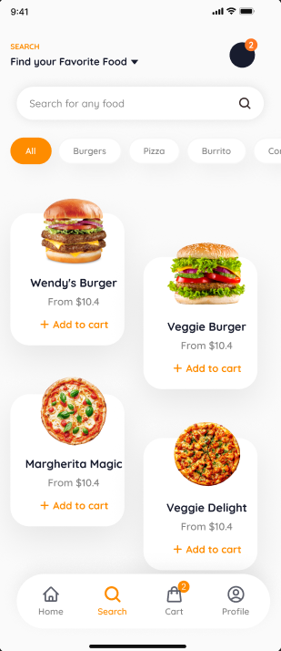
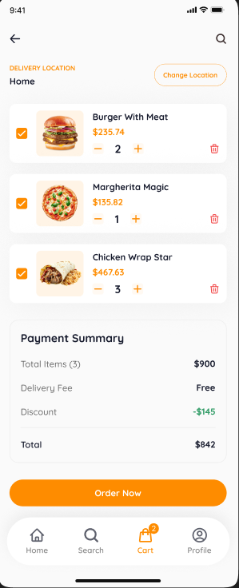
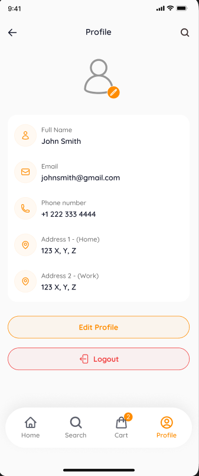

  

<h1 align="center">Platera</h1>

  A modern React Native food ordering demo application built for browsing meals, customizing orders, and delivering a smooth mobile ordering experience.

  
  
  
  
  
  

---

# 🍔 About Platera

Platera is a mobile food ordering demo application built with React Native and Expo.

The app allows users to browse meals, explore categories, customize menu items, manage their cart, and place food orders through a clean and responsive mobile interface.

Platera uses Appwrite as the backend/database solution and Zustand for lightweight global state management.

---

# ✨ Features

- 🔐 User Authentication
  - Sign In
  - Sign Up
  - Session-based authentication

- 🏠 Home Screen
  - Featured meals and promotions
  - Browse food categories
  - Personalized recommendations

- 🍕 Menu System
  - View meal details
  - Ratings and nutritional information
  - Meal customization support

- 🛒 Cart Management
  - Add/remove meals
  - Quantity management
  - Persistent cart state using Zustand

- 🔎 Search & Discovery
  - Search meals dynamically
  - Explore categories and offers

- 👤 User Profile
  - Account information
  - Order-related functionality

---

# 📱 Screens

## Authentication

  
  

---

## Home Screen

  
  &nbsp;&nbsp;&nbsp;
  
  &nbsp;&nbsp;&nbsp;
  

---

## Menu & Food Details

  
  &nbsp;&nbsp;&nbsp;
  

---

## Search Screen

  

---

## Cart Screen

  

---

## Profile Screen

  

---

# 🛠️ Tech Stack

- React Native
- Expo
- Expo Router
- TypeScript
- Zustand
- Appwrite
- TailwindCSS / NativeWind
